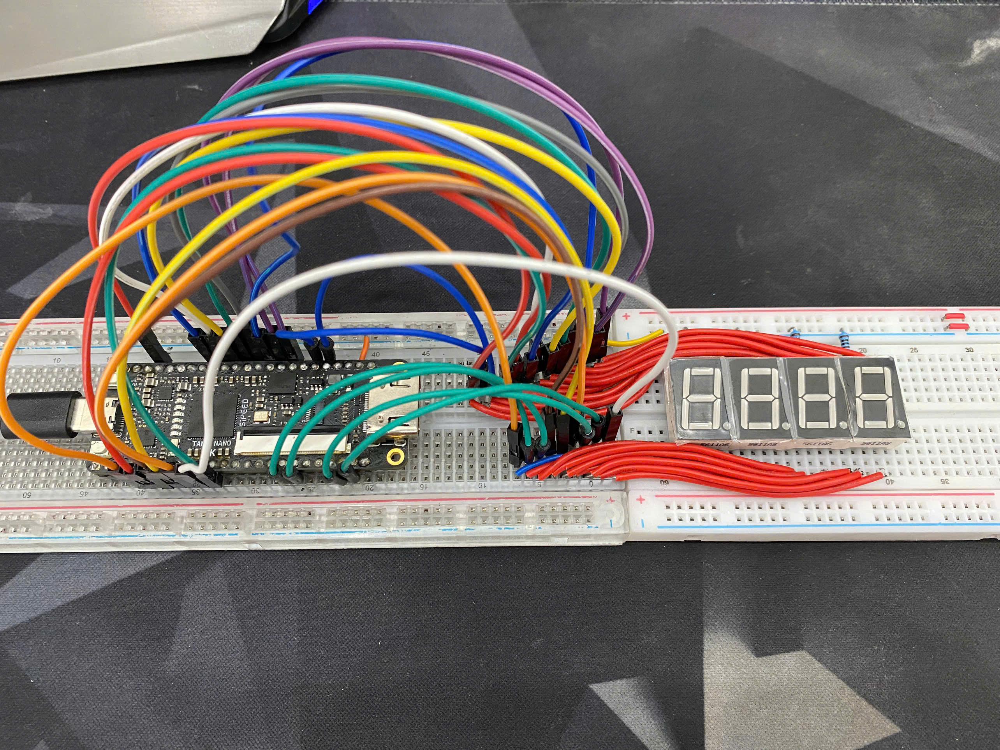

# A simple custom CPU implemented in Verilog, running on Tang Nano 9K FPGA
### It uses custom Assembly to solve the problems.
## Features:
### - Harvard Architecture.
### - Register C - temporary register for holding intermediate results.
### - ALU: add, sub, shift, rotate, slt,...
### - Separate RAM & ROM.
### - LOAD/STORE Instructions.
### - Conditional/unconditional jumps.
### - Using custom Assembly and custom ISA (<a href="https://docs.google.com/document/d/1spk6qTvlEQv3vK2T30NwYCHgVy-ZGenoJlQO8q8Q0LQ/edit?tab=t.0" target="_blank">More Detailed</a>)
### - Runs on Tang Nano 9K FPGA.
## A Picture of my CPU mini

## User Instruction and Example Code
### User Instruction:
#### Step 1: Clone repo 
#### Step 2: Open in Gowin IDE
#### Step 3: Write your own program by writing custom assembly code into "assembly.txt" file, then use "assembly_to_machine_code.cpp" to convert custom assembly -> machine code. Then use "rom_convert.cpp" to create a hardwired ROM so cpu can run on Tang Nano 9K.
#### Step 4: Create your own physical constraint file and timing constraint file on IDE.
#### Step 5: Flash to Tang Nano 9K.
#### >>>The process of converting hardwired ROM requires us to re-flashing data on fpga so it takes a long time. Planned upgrade: UART loader to allow program without re-flashing the FPGA.<<<
### Example Code:
#### - I will show a example code how to write custom assembly to do 10 + 5 and JUMP to HLT command:
<pre>  MOV_C, #10
  MOV_Rs A, C
  MOV_C, #5
  ADD A
  JP END
  SUB A
END
  HLT  </pre>
#### - All the command need to be go through register C (I will write custom compiler C to convert C -> my custom assembly so that is more user-friendly.)
#### - So when the result is 15 => It is Positive => JUMP to the address that has the name "END", that is where HLT command placed.
## My Goal
### My goal is to solve problems using my own CPU so I can learn computer architecture, digital design, i/o communication, algorithm solving skills,...
## Planned Upgrades
### - UART loader for faster program loading
### - Add more i/o communications
### - More instruction (CALL/RET...)
### - Compiler C to convert C language -> custom assembly
## Feedback
### - This project is built by one person and I use AI as a study partner for explanations and suggestions.
### - If you see a bug or any flaw in my design, feel free to comment to help me better. Thanks a lot!

